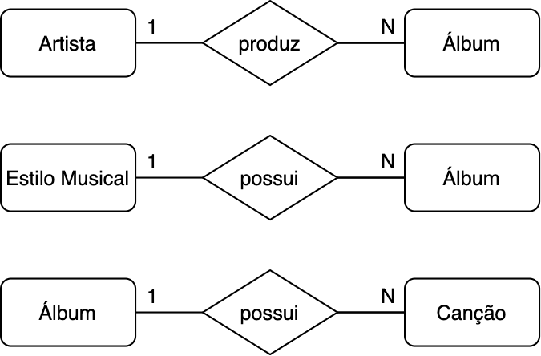
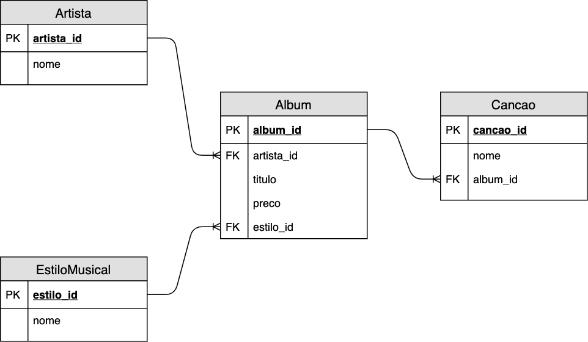
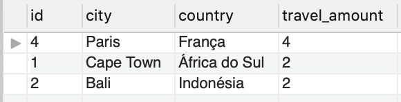
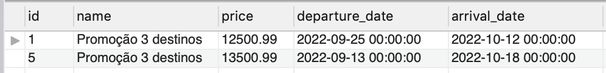

# Boas vindas ao repositório do projeto Queries Unite!

Você já usa o GitHub diariamente para desenvolver os exercícios, certo? Agora, para desenvolver os projetos, você deverá seguir as instruções a seguir. Fique atento a cada passo e, se tiver qualquer dúvida, nos envie por Slack! #vqv 🚀

Aqui você vai encontrar os detalhes de como estruturar o desenvolvimento do seu projeto a partir desse repositório, utilizando uma branch específica e um Pull Request para colocar seus códigos.

---

## ANTES DE COMEÇAR A DESENVOLVER:

1. Clone o repositório
  * `git clone https://github.com/tryber/sd-02-block23-project-queries-unite.git`.
  * Entre na pasta do repositório que você acabou de clonar:
    * `cd sd-02-block23-project-queries-unite`

2. Crie uma branch a partir da branch `master`
  * Verifique que você está na branch `master`
    * Exemplo: `git branch`
  * Se não estiver, mude para a branch `master`
    * Exemplo: `git checkout master`
  * Agora, crie uma branch onde você vai guardar os `commits` do seu projeto
    * Você deve criar uma branch no seguinte formato: `nome-de-usuario-nome-do-projeto`
    * Exemplo: `git checkout -b jhonatan-de-souza-queries-unite`

3. Para cada exercício você deve criar um novo arquivo sql seguindo a seguinte estrutura:
  * desafio1.sql, desafio2.sql, desafio3.sql, desafio4.sql, ..., desafioN.sql

4. Adicione as mudanças ao _stage_ do Git e faça um `commit`
  * Verifique que as mudanças ainda não estão no _stage_
    * Exemplo: `git status` (deve aparecer o arquivo que você alterou como desafio1.sql)
  * Adicione o novo arquivo ao _stage_ do Git
      * Exemplo:
        * `git add .` (adicionando solução para desafio 1)
        * `git status` (deve aparecer listado o arquivo _desafio1.sql_ em verde)
  * Faça o `commit` inicial
      * Exemplo:
        * `git commit -m 'Iniciando o projeto Queries Unite'` (fazendo o primeiro commit)
        * `git status` (deve aparecer uma mensagem tipo _nothing to commit_ )

6. Adicione a sua branch com o novo `commit` ao repositório remoto
  * Usando o exemplo anterior: `git push -u origin seunome-queries-unite`

7. Crie um novo `Pull Request` _(PR)_
  * Vá até a página de _Pull Requests_ do [repositório no GitHub](https://github.com/tryber/sd-02-block23-project-queries-unite/pulls)
  * Clique no botão verde _"New pull request"_
  * Clique na caixa de seleção _"Compare"_ e escolha a sua branch **com atenção**
  * Clique no botão verde _"Create pull request"_
  * Adicione uma descrição para o _Pull Request_ e clique no botão verde _"Create pull request"_
  * **Não se preocupe em preencher mais nada por enquanto!**
  * Volte até a [página de _Pull Requests_ do repositório](https://github.com/tryber/sd-02-block23-project-queries-unite/pulls) e confira que o seu _Pull Request_ está criado

---

## DURANTE O DESENVOLVIMENTO

* ⚠ **LEMBRE-SE DE CRIAR TODOS OS ARQUIVOS DENTRO DA PASTA COM O SEU NOME** ⚠

* Faça `commits` das alterações que você fizer no código regularmente

* Lembre-se de sempre após um (ou alguns) `commits` atualizar o repositório remoto

* Os comandos que você utilizará com mais frequência são:
    1. `git status` _(para verificar o que está em vermelho - fora do stage - e o que está em verde - no stage)_
    2. `git add` _(para adicionar arquivos ao stage do Git)_
    3. `git commit` _(para criar um commit com os arquivos que estão no stage do Git)_
    5. `git push -u nome-da-branch` _(para enviar o commit para o repositório remoto na primeira vez que fizer o `push` de uma nova branch)_
    4. `git push` _(para enviar o commit para o repositório remoto após o passo anterior)_

---

## O que deverá ser desenvolvido

Hoje você modelará um banco de dados do zero, fazendo todo o processo de leitura do problema, criação das entidades, atributos, relacionamentos, além de popular o banco de dados e providenciar queries para extrair as informações solicitadas.

---

## Como desenvolver e entregar este projeto

A seguir, tem-se a apresentação de um problema que deve ser resolvido com a modelagem de um novo banco de dados. Cada passo solicita um tipo de resposta diferente. Para cada desafio crie um arquivo SQL e inclua sua solução nele.

1. Leia a pergunta e crie um arquivo chamado `desafioN.sql`, em que N é o número do desafio (exemplo: desafio3.sql).

2. O arquivo deve conter apenas o código SQL do desafio resolvido. **Não se esqueça de incluir o ponto e vírgula (";")** no final de suas queries e também de **colocar o nome do banco_de_dados.tabela por completo**, como no exemplo a seguir.

```sql
SELECT * FROM queries_unite.orders;
```

3. Atente-se a diferença mínimas em seu código, qualquer diferença em nomes, apelidos, ou CAIXA ALTA e caixa baixa podem invalidar suas respostas.

4. Faça isso até finalizar todos os desafios e depois siga as instruções de como entregar o projeto em [**Instruções para entregar seu projeto**](#instruções-para-entregar-seu-projeto)

---

### Problema a ser resolvido

Imagine que a gerência de sua empresa de desenvolvimento de software solicitou para você que um banco de dados seja projetado para a seguinte situação:

"Precisamos montar a estrutura do banco de dados que será usado no sistema de agendamento de viagens. A estrutura esperada para este módulo do sistema deve ser capaz de armazenar informações importantes sobre as pessoas que usam a aplicação, como: nome, idade e profissão. Devemos ter uma maneira de armazenar informações sobre as possíveis viagens que uma pessoa pode fazer, tais como: nome do pacote, destino (que deve conter no mínimo informações sobre a cidade e país de destino), data prevista de ida, data prevista de volta e custo total da viagem."

* Uma pessoa pode comprar mais de um pacote de viagens, mas **não** pode comprar o mesmo pacote duas ou mais vezes;

* Um pacote de viagens pode possuir mais de um destino;

* Um pacote de viagens deve possuir o campo `purchase_count` (contagem de compras), com o valor padrão de 0;

* Toda coluna que representa o identificador único dos registros de uma tabela deve ter seu valor gerado automaticamente de forma incremental, com exceção de tabelas que sejam agregações de outras tabelas (como é o caso da tabela `film_category` do banco `sakila`, por exemplo).

---

### Dados

Tendo em mente a descrição acima, a estrutura do banco de dados criado deve ser capaz de armazenar todas as informações abaixo:

* Rafael Martins, 33, Arquiteto, contratou o pacote "Promoção 3 destinos" no valor de R$12.500,99 e tem uma viagem programada para o dia 25/09/2022, com a volta prevista para o dia 12/10/2022. A viagem deve passar pelos seguintes destinos:
    - Cape Town, África do Sul;

    - Bali, Indonésia;

    - Marrakesh, Marrocos.

* Amanda Rocha, 25, Desenvolvedora de Software, contratou o pacote "Vem Pro Verão" no valor de R$9.650,99 e tem uma viagem programa para o dia 16/10/2022, com a volta prevista para o dia 26/10/2022. A viagem deve passar por dois destinos diferentes:
    - Paris, França;

    - Nova Iorque, Estados Unidos.

* Jonas Cabral, 18, Pintor, contratou o pacote "Cultura Francesa" no valor de R$3.900,99 e tem uma viagem programada para o dia 12/07/2022, com a volta prevista para o dia 20/07/2022. A viagem tem o destino único de:
    - Paris, França.

* Carol Domingues, 37, Contadora, contratou o pacote "Vem Pro Verão" no valor de R$7.725,99 e tem uma viagem programada para o dia 19/02/2022, com a volta prevista para o dia 26/03/2022. A viagem possui os seguintes destinos:
    - Cape Town, África do Sul;

    - Bali, Indonésia.

* Sabrina Ferreira, 45, Engenheira de Alimentos, contratou o pacote "Cultura Francesa" no valor de R$3.900,99 e tem uma viagem programada para o dia 12/07/2022, com a volta prevista para o dia 20/07/2022. A viagem tem o destino único de:
    - Paris, França.

* Sabrina Ferreira, 45, Engenheira de Alimentos, também contratou o pacote "Promoção 3 destinos" com o valor de R$13.500,99 e tem uma viagem programa para o dia 13/09/2022, com a volta prevista para o dia 18/10/2022. A viagem possui os seguintes destinos:
    - Marrakesh, Marrocos;

    - Nova Iorque, Estados Unidos;

    - Paris, França.

Mais adiante neste projeto, você será solicitado a popular o banco de dados que criar, com os dados acima.

---

### Identifique as entidades

Com base no problema apresentado anteriormente identifique as entidades presentes na história. Suas entidades devem representar:

* A pessoa (`users`);

* O pacote de viagens (`travel_packages`);

* O destino (`locations`);

* A agregação entre pacotes de viagens e destinos (`travel_packages_locations`);

* A compra de pacotes de viagens pelas pessoas (`purchases`).

Seu objetivo aqui é de ter essa informação em algum lugar, para que possa usar nos próximos passos.

---

### Identifique os atributos

Identifique e anote os atributos das entidades encontradas no passo anterior, com exceção de `users`, cujos atributos devem ser:

* `id`: Identificador único da pessoa;

* `full_name`: Nome completo da pessoa;

* `current_age`: Idade atual da pessoa;

* `current_job`: Profissão atual da pessoa.

Leia a descrição do problema novamente para ter certeza que, no mínimo, os atributos especificados na descrição foram identificados. Todas as tabelas devem possuir algum campo identificador (campo que identifica unicamente o registro).

**Dica:** um campo indentificador pode ser composto por uma ou mais colunas. 😉

Seu objetivo aqui é de ter essa informação em algum lugar, para que possa usar nos próximos passos.

---

### Identifique os relacionamentos

Identifique os relacionamentos entre cada uma das entidades.

Feito isso crie um diagrama de relacionamento das entidades `users`, `travel_packages`, `locations`, `travel_packages_locations` e `purchases`. Veja, a seguir, um exemplo de diagrama que demonstra relacionamentos entre entidades de forma visual.



Esta seção é crucial para que você consiga mapear e visualizar como uma entidade deve se relacionar com as outras. Seu objetivo aqui é de ter essa informação em algum lugar, para que possa usar nos próximos passos.

---

### Diagrama Entidade-Relacionamento detalhado

Crie um diagrama entidade-relacionamento contendo as informações sobre as entidades, atributos e relacionamentos. Faça-o de forma similar ao diagrama abaixo (apenas uma ilustração 😎):



Você pode fazer esse diagrama tanto em papel quanto através de alguma ferramenta de diagramação como o [draw.io](https://www.draw.io/). Caso decida usar o [draw.io](https://www.draw.io/), veja [este vídeo](https://www.youtube.com/watch?v=lAtCySGDD48) e aprenda mais sobre essa ferramenta. Lembre-se que você pode ativar a legenda do vídeo, marcar a opção de tradução automática e depois selecionar o idioma português.

Esta seção também é crucial para que você consiga modelar bancos de dados com sucesso, incluindo o deste projeto. Seu objetivo aqui é de ter essa informação em algum lugar, para que possa usar nos desafios.

---

## Desafio 1 - Providencie a estrutura do banco de dados

Providencie um único arquivo SQL com o nome de `desafio1.sql`, que ao ser executado deve:

* Criar o banco de dados de nome `queries_unite`, **em caixa baixa**;

* Definir o banco de dados `queries_unite` como ativo;

* Criar todas as tabelas necessárias;

* Popular o seu banco **somente** com as informações presentes na seção [**Dados**](#dados) (insira apenas os valores entregues, **não modifique-os** para CAIXA ALTA ou caixa baixa, insira-os **exatamente** como estão na descrição).

#### Exemplo de como popular um banco de dados

```mysql
CREATE DATABASE IF NOT EXISTS queries_unite;

USE queries_unite;

CREATE TABLE tabela1(
    coluna1 tipo restricoes,
    coluna2 tipo restricoes,
    colunaN tipo restricoes,
);

CREATE TABLE tabela2(
    coluna1 tipo restricoes,
    coluna2 tipo restricoes,
    colunaN tipo restricoes,
);

INSERT INTO tabela1 (coluna1, coluna2)
       VALUES ('exemplo de dados 1', 'exemplo de dados A'),
              ('exemplo de dados 2', 'exemplo de dados B'),
              ('exemplo de dados 3', 'exemplo de dados C');

INSERT INTO tabela2 (coluna1, coluna2)
       VALUES ('exemplo de dados 1', 'exemplo de dados X'),
              ('exemplo de dados 2', 'exemplo de dados Y');
```

## Desafio 2 - Clone a tabela `users`

Crie um clone chamado `clone_troopers` para a tabela `users`.

## Desafio 3 - Altere a tabela `clone_troopers`

Faça as seguintes alterações na tabela `clone_troopers`:

* Adicione a coluna `nickname`, que deve ser do tipo `VARCHAR(50)`, não nulo;

* Altere a coluna `current_age`, de forma que seu tipo passe a ser `TINYINT`;

* Altere o nome da coluna `full_name` para `origin_name` e garanta que não seja possível inserir nomes repetidos;

* Exclua a coluna `current_job`.

## Desafio 4 - Exclua a tabela `clone_troopers`

Exclua a tabela `clone_troopers`.

## Desafio 5 - VIEW travel_package_info

Crie uma `VIEW` chamada `travel_package_info`, que deve mostrar todas as compras cadastradas no sistema, exibindo os resultados da seguinte forma:

* `travel_package_id`: Identificação única do pacote de viagens;

* `travel_package_name`: Nome do pacote de viagens;

* `user_id`: Identificação única da pessoa;

* `user_name`: Nome da pessoa;

* `cost`: Custo total da viagem.

Os resultados da `VIEW` devem ser ordenados pelo custo total das viagens de forma decrescente. Ao fazer uma pesquisa em sua `VIEW` sem filtros você deve produzir os mesmos resultados da imagem a seguir:


## Desafio 6 - VIEW amount_spent_by_user

Crie uma `VIEW` chamada `amount_spent_by_user`, que mostre o nome e total gasto em viagens até o momento por todos as pessoas presentes no sistema, conforme as especificações a seguir:

* `user_id`: Identificação única da pessoa;

* `user_name`: Nome da pessoa;

* `amount`: Total gasto pela pessoa.

Os gastos devem estar agrupados e ordenados de forma crescente. Ao fazer uma pesquisa em sua `VIEW` sem filtros você deve produzir os mesmos resultados da imagem a seguir.


## Desafio 7 - VIEW top_3_locations

Crie uma `VIEW` chamada `top_3_locations`, que exibe os top 3 destinos mais frequentados, de acordo com as especificações a seguir:

* `id`: Identificação única da localização;

* `city`: Nome da cidade;

* `country`: Nome do país;

* `travel_amount`: Quantidade de visitas à localização.

Os resultados devem ser agrupados pela coluna identificadora do destino e ordenados pela quantidade de visitas à localização, de forma decrescente. Caso haja mais de uma localização com a mesma quantidade de visitas, o critério de desempate será a ordenação pelo id da localização, de forma crescente. Ao fazer uma pesquisa em sua `VIEW` sem filtros você deve produzir os mesmos resultados da imagem a seguir.



## Desafio 8 - VIEW revenue_report

Crie uma nova `VIEW` chamada `revenue_report`, que deve exibir um relatório de lucros com as seguintes informações:

* `lowest_revenue`: Menor lucro, individual, obtido com um pacote de viagens;

* `biggest_revenue`: Lucro máximo, individual, obtido com um pacote de viagens;

* `average_revenue`: Lucro médio obtido com todos os pacotes de viagens;

* `total_revenue`: Lucro total obtido com todos os pacotes de viagens.

**Dica:** Recomenda-se fazer uso de subquery para resolver este desafio.

Ao fazer uma pesquisa em sua `VIEW` sem filtros você deve produzir os mesmos resultados da imagem a seguir.


## Desafio 9 - PROCEDURE find_travel_packages_by_period

Você deve criar uma `PROCEDURE` chamada `find_travel_packages_by_period`, que simula a funcionalidade de busca com filtros. Essa `PROCEDURE` deve receber 2 parâmetros de entrada: a data prevista de ida e a data previsa de volta. Ao ser executada ela deve retornar somente os resultados contidos dentro da faixa de datas especificadas.

Para validar sua `PROCEDURE`, execute-a com os parâmetros data inicial e data final, com os respectivos valores de 17/07/2022 (`'2022-07-17'`) e 25/10/2022 (`'2022-10-25'`). O resultado deve ser exatamente igual ao da imagem abaixo:



## Desafio 10 - FUNCTION average_amount_spent_given_age_range

Você deve criar uma `FUNCTION` chamada `average_amount_spent_given_age_range`, que recebe como parâmetros uma idade mínima e uma idade máxima. Sua `FUNCTION` deve retornar apenas o valor médio gasto em compras de pacotes nessa faixa etária. O resultado retornado pelo cálculo deve ser do tipo `DOUBLE`.

Para validar sua `FUNCTION`, execute-a com os parâmetros idade mínima e idade máxima, com os respectivos valores de 30 e 50 anos. O resultado deve ser exatamente igual ao da imagem abaixo:


## Desafio 11 - TRIGGER increment_travel_package_purchases

Você deve criar um `TRIGGER` chamado `increment_travel_package_purchases`, que será disparado a cada nova compra de um pacote de viagens. Quando disparado, esse `TRIGGER` deve incrementar em um a quantidade de compras do pacote definida na coluna `purchase_count`.

Para validar seu `TRIGGER`, crie-o antes de inserir seus dados no banco. Caso você já tenha populado o banco, você pode excluí-lo e gerá-lo novamente, tendo definido o `TRIGGER` antes dos comandos de inserção de dados.

Uma vez populado o banco já com o `TRIGGER` definido, execute a query:
```sql
SELECT
    id,
    purchase_count
FROM queries_unite.travel_packages;
```
O resultado esperado para essa consulta é:


## Desafio 12 - INDEX users_full_name_index

Para facilitar a busca por pessoas cadastradas no sistema, adicione um `INDEX` chamado `users_full_name_index` na coluna `full_name` da tabela `users`.

## Desafio 13 - FULLTEXT INDEX users_current_job_index

Para facilitar estudos internos do perfil das pessoas que compram os pacotes de viagens, adicione um `FULLTEXT INDEX` chamado `users_current_job_index` na coluna `current_job` da tabela `users`.

---

## Instruções para entregar seu projeto:

### Entregáveis

Para entregar o seu projeto você deverá criar um Pull Request neste repositório. Este Pull Request deverá conter os arquivos SQL dos desafios 1 ao 13.

Qualquer dúvida, procure a monitoria. Lembre-se que você pode consultar nosso conteúdo sobre Git & GitHub sempre que quiser!

### DEPOIS DE TERMINAR O DESENVOLVIMENTO

Para submeter o _Pull Request_ do seu projeto para avaliação, siga os passos a seguir:

* Vá até a página **DO SEU** _Pull Request_, adicione a label de _"code-review"_ e marque seus colegas
  * No menu à direita, clique no _link_ **"Labels"** e escolha a _label_ **code-review**
  * No menu à direita, clique no _link_ **"Assignees"** e escolha **o seu usuário**
  * No menu à direita, clique no _link_ **"Reviewers"** e digite `students`, selecione o time `tryber/students-sd-02`

Se ainda houver alguma dúvida sobre como entregar seu projeto, [aqui tem um video explicativo](https://vimeo.com/362189205).
